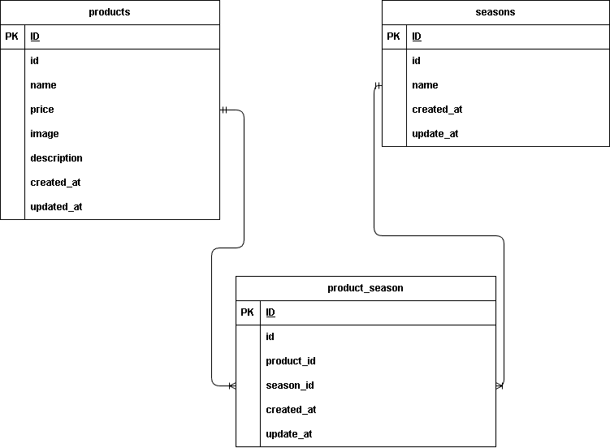

# アプリケーション名
- 果物商品ページ

## 環境構築
- git clone git@github.com:sophy-iu/freshly-picked.git
- docker-compose up -d --build
- docker-compose exec php bash
- composer install
- composer require laravel/fortify
- cp .env.example .env ,環境変数を適宜変更
- php artisan make:migration create_products_table ,カラムの追加は下記ER図参照
- php artisan make:migration create_seasons_table ,カラムの追加は下記ER図参照
- php artisan make:migration create_product_season_table ,カラムの追加は下記ER図参照
- php artisan migrate
- php artisan make:seeder ProductsTableSeeder ,カラムの追加は下記ER図参照
- php artisan make:seeder SeasonsTableSeeder ,カラムの追加は下記ER図参照
- php artisan make:seeder ProductSeasonTableSeeder ,カラムの追加は下記ER図参照
- php artisan db:seed

## 使用技術
- nginx（Webサーバ）
- PHP 8.1（php-fpm）
- MySQL 8.0
- phpMyAdmin

## ER図

## URL
- 商品一覧ページ：http://localhost/products
- 商品詳細ページ：http://localhost/products/detail/{:productId}
- 商品登録ページ：http://localhost/products/register
- 管理画面：http://localhost/admin
- 検索：http://localhost/products/search
